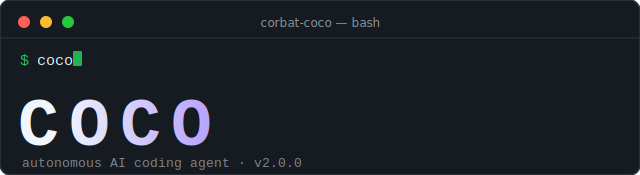

<p align="center">
  
</p>

<h1 align="center">🥥 Corbat-Coco</h1>

<p align="center">
  <strong>The AI Coding Agent That Actually Ships Production-Ready Code</strong>
</p>

<p align="center">
  <em>Self-reviewing • Quality-obsessed • Never ships crap</em>
</p>

<p align="center">
  <a href="https://github.com/corbat/corbat-coco/actions/workflows/ci.yml"></a>
  <a href="https://codecov.io/gh/corbat/corbat-coco"></a>
  <a href="https://www.npmjs.com/package/corbat-coco"></a>
  <a href="https://opensource.org/licenses/MIT"></a>
</p>

<br />

<p align="center">
  
</p>

---

## 💡 The Problem

AI coding assistants generate code that **looks good but breaks in production**. You end up:
- 🔄 Going back and forth fixing bugs
- 🧪 Writing tests after the fact (if at all)
- 🤞 Hoping edge cases don't blow up
- 📝 Explaining the same patterns over and over

## ✨ The Solution

**Corbat-Coco iterates on its own code until it's actually good.**

```
Generate → Test → Review → Improve → Repeat until senior-level quality
```

Every piece of code goes through **self-review loops** with **11-dimension quality scoring**. It doesn't stop until it reaches 85+ quality score.

---

## 🚀 Quick Start

```bash
# Install globally
npm install -g corbat-coco

# Start the interactive REPL
coco

# That's it. Coco guides you through the rest.
```

On first run, Coco will help you:
1. **Choose a provider** (Anthropic, OpenAI, Google, Moonshot)
2. **Set up your API key** (with secure storage options)
3. **Configure your preferences**

---

## 🎯 What Makes Coco Different

<table>
<tr>
<td width="50%">

### Other AI Assistants
```
You: "Build a user auth system"
AI: *generates code*
You: "This doesn't handle edge cases"
AI: *generates more code*
You: "The tests are broken"
AI: *generates even more code*
...3 hours later...
```

</td>
<td width="50%">

### Corbat-Coco
```
You: "Build a user auth system"
Coco: *generates → tests → reviews*
      "Score: 72/100 - Missing rate limiting"
      *improves → tests → reviews*
      "Score: 86/100 ✅ Ready"

...15 minutes later, production-ready...
```

</td>
</tr>
</table>

### Feature Comparison

| Feature | Cursor/Copilot | Claude Code | **Corbat-Coco** |
|---------|:--------------:|:-----------:|:---------------:|
| Generate code | ✅ | ✅ | ✅ |
| **Self-review loops** | ❌ | ❌ | ✅ |
| **Quality scoring** | ❌ | ❌ | ✅ (11 dimensions) |
| **Auto-iteration until good** | ❌ | ❌ | ✅ |
| Architecture planning | Basic | Basic | ✅ Full ADR system |
| Progress persistence | ❌ | Session | ✅ Checkpoints |
| Production CI/CD | ❌ | ❌ | ✅ Auto-generated |

---

## 📊 The Quality Engine

Every code iteration is scored across **11 dimensions**:

| Dimension | What It Measures |
|-----------|------------------|
| **Correctness** | Tests pass, logic is sound |
| **Completeness** | All requirements implemented |
| **Robustness** | Edge cases handled |
| **Readability** | Clean, understandable code |
| **Maintainability** | Easy to modify later |
| **Complexity** | Cyclomatic complexity in check |
| **Duplication** | DRY principles followed |
| **Test Coverage** | Line and branch coverage |
| **Test Quality** | Tests are meaningful |
| **Security** | No vulnerabilities |
| **Documentation** | Code is documented |

**Minimum threshold: 85/100** — Senior engineer level.

---

## 🛠️ Supported Providers

Coco works with multiple AI providers. Choose what fits your needs:

| Provider | Models | Best For |
|----------|--------|----------|
| 🟠 **Anthropic** | Claude Sonnet 4, Opus 4, 3.7 | Best coding quality |
| 🟢 **OpenAI** | GPT-4o, o1, o1-mini | Fast iterations |
| 🔵 **Google** | Gemini 2.0 Flash/Pro | Large context (2M tokens) |
| 🌙 **Moonshot** | Kimi K2.5, K2 | Great value |

**Switch anytime** with `/provider` or `/model` commands.

---

## 💻 Usage Examples

### New Project: Build from Scratch

```bash
$ coco

🥥 Welcome to Corbat-Coco!

> Build a REST API for task management with auth

📋 Analyzing requirements...
📐 Creating architecture (3 ADRs)...
📝 Generated backlog: 2 epics, 8 stories

🔨 Building...

Task 1/8: User model ✓ (2 iterations, 91/100)
Task 2/8: Auth service ✓ (3 iterations, 88/100)
Task 3/8: JWT middleware ✓ (2 iterations, 94/100)
...

📊 Complete!
├─ Quality: 90/100 average
├─ Coverage: 87%
└─ Security issues: 0
```

### Existing Project: Execute Tasks

```bash
$ cd my-backend
$ coco

> Add GET /users/:id/orders endpoint with pagination

🔍 Analyzing codebase...
✓ Detected: TypeScript + Express
✓ Found existing patterns in UserController

🔨 Implementing...

Step 1/4: OrderController ✓ (2 iterations, 93/100)
Step 2/4: OrderService ✓ (1 iteration, 96/100)
Step 3/4: Tests ✓ (2 iterations, 89/100)
Step 4/4: OpenAPI docs ✓ (1 iteration, 97/100)

📊 Done in 8 minutes
├─ Files: 4 created, 1 modified
├─ Tests: 15 added (all passing)
└─ Coverage: 94%

> /commit
✓ feat(orders): add user orders endpoint with pagination
```

### Interactive REPL Commands

```bash
/help          # Show all commands
/status        # Project & git status
/model         # Change AI model
/provider      # Switch provider
/memory        # View conversation context
/compact       # Compress context if running low
/clear         # Clear conversation
/exit          # Exit REPL
```

---

## ⚙️ Configuration

### Environment Variables

```bash
# Choose ONE provider (or set multiple to switch between them)
export ANTHROPIC_API_KEY="sk-ant-..."   # Anthropic Claude
export OPENAI_API_KEY="sk-..."          # OpenAI
export GEMINI_API_KEY="..."             # Google Gemini
export KIMI_API_KEY="..."               # Moonshot Kimi
```

### Project Config (`.coco/config.json`)

```json
{
  "provider": {
    "type": "anthropic",
    "model": "claude-sonnet-4-20250514"
  },
  "quality": {
    "minScore": 85,
    "minCoverage": 80,
    "maxIterations": 10
  }
}
```

---

## 📚 The COCO Methodology

Four phases from idea to deployment:

```
┌──────────┐    ┌────────────┐    ┌──────────┐    ┌────────┐
│ CONVERGE │ →  │ ORCHESTRATE│ →  │ COMPLETE │ →  │ OUTPUT │
└──────────┘    └────────────┘    └──────────┘    └────────┘
     │               │                 │              │
 Understand      Plan &            Execute &      Deploy &
 Requirements    Design            Iterate        Document
```

| Phase | What Happens | Output |
|-------|--------------|--------|
| **Converge** | Q&A to understand requirements | Specification |
| **Orchestrate** | Architecture design, create backlog | ADRs, Stories, Tasks |
| **Complete** | Build with quality iteration loops | Production code + tests |
| **Output** | Generate deployment artifacts | CI/CD, Dockerfile, Docs |

---

## 🔧 Development

```bash
# Clone
git clone https://github.com/corbat/corbat-coco.git
cd corbat-coco

# Install
pnpm install

# Development mode
pnpm dev

# Run tests
pnpm test

# Full check (typecheck + lint + test)
pnpm check

# Build
pnpm build
```

---

## 🗺️ Roadmap

- [x] Multi-provider support (Anthropic, OpenAI, Gemini, Kimi)
- [x] Interactive REPL with autocomplete
- [x] Checkpoint & recovery system
- [ ] VS Code extension
- [ ] Web dashboard
- [ ] Team collaboration
- [ ] Local model support (Ollama)

---

## 🤝 Contributing

Contributions welcome! See [CONTRIBUTING.md](CONTRIBUTING.md).

```bash
# Quick contribution flow
git checkout -b feat/amazing-feature
pnpm check  # Must pass
git commit -m "feat: add amazing feature"
```

---

## 📄 License

MIT — See [LICENSE](LICENSE).

---

<p align="center">
  <strong>Stop babysitting your AI. Let Coco iterate until it's right.</strong>
</p>

<p align="center">
  <a href="https://github.com/corbat/corbat-coco">⭐ Star on GitHub</a> •
  <a href="https://github.com/corbat/corbat-coco/issues">Report Bug</a> •
  <a href="https://github.com/corbat/corbat-coco/discussions">Discussions</a>
</p>
