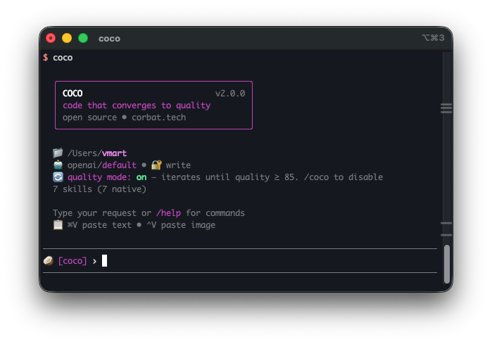

<div align="center">



<br/>

[](https://www.npmjs.com/package/@corbat-tech/coco)
[](https://nodejs.org/)
[](LICENSE)

[Install](#install) · [Quick Start](#quick-start) · [What Coco Does](#what-coco-does) · [Providers](#providers) · [Documentation](#documentation)

</div>

---

## What Is Coco?

Coco is a CLI coding agent for real projects. It can plan work, edit files, run tools and tests, and iterate until a quality threshold is reached.

Core idea: instead of a single "here is some code" response, Coco runs an implementation loop with validation and fixes.

## What Coco Does

- Multi-step execution in one run: explore -> implement -> test -> refine.
- Quality mode with convergence scoring (configurable threshold and max iterations).
- Native tool use: files, git, shell, search/web, review, diff, build/test, MCP servers.
- Multi-provider support (API, subscription, and local models).
- Session-oriented REPL with slash commands, context compaction, and resumable workflows.

Coco is designed to be useful on medium and large repos, not only toy examples.

## Install

### Prerequisites

- Node.js `22+`
- macOS or Linux
- Windows: use WSL2

```bash
node --version
```

### Global install

```bash
npm install -g @corbat-tech/coco
# or
pnpm add -g @corbat-tech/coco
```

Verify:

```bash
coco --version
```

## Quick Start

```bash
# Example with Anthropic
export ANTHROPIC_API_KEY="..."

# Start interactive mode
coco

# Or run a direct task
coco "Add JWT auth to this API with tests"
```

On first run, Coco guides provider/model setup.

## Typical Workflow

1. You give a task.
2. Coco proposes or derives a plan.
3. Coco edits code and runs tools/tests.
4. In quality mode, Coco scores output and iterates on weak points.
5. Coco returns summary + diffs/results.

Quality mode is configurable and can be turned on/off per session.

## Commands (REPL)

Common commands:

- `/help` show available commands and skills.
- `/provider` switch provider.
- `/model` switch model.
- `/quality [on|off]` toggle convergence mode.
- `/check` run checks in project context.
- `/review` run code review workflow.
- `/diff` inspect current changes.
- `/ship` run release-oriented workflow.
- `/permissions` inspect/update tool trust.
- `/compact` compact session context.

Natural language requests are supported too; commands are optional.

## Providers

Coco currently supports these provider IDs:

- `anthropic`
- `openai`
- `copilot`
- `gemini`
- `kimi`
- `kimi-code`
- `groq`
- `openrouter`
- `mistral`
- `deepseek`
- `together`
- `huggingface`
- `qwen`
- `ollama` (local)
- `lmstudio` (local)

Notes:

- `openai` supports API-key mode and OAuth flow (mapped internally when needed).
- `copilot` and subscription-backed providers rely on their own auth flow.
- Local providers run through OpenAI-compatible endpoints.

For setup details and model matrix:

- [Provider Guide](docs/guides/PROVIDERS.md)

## Skills and MCP

Coco supports:

- Built-in skills (for example `/review`, `/ship`, `/open`, `/diff`).
- Project/user skills loaded from skill files.
- MCP servers for external tools and systems.

References:

- [MCP Guide](docs/MCP.md)
- [Cookbook](docs/guides/COOKBOOK.md)

## Configuration

Project-level config in `.coco.config.json` and CLI-level config via `coco config`.

Example:

```json
{
  "name": "my-service",
  "language": "typescript",
  "quality": {
    "minScore": 88,
    "maxIterations": 8
  }
}
```

See:

- [Configuration Guide](docs/guides/CONFIGURATION.md)

## Documentation

- [Quick Start](docs/guides/QUICK_START.md)
- [Cookbook](docs/guides/COOKBOOK.md)
- [Quality Guide](docs/guides/QUALITY.md)
- [Providers](docs/guides/PROVIDERS.md)
- [Architecture](docs/architecture/ARCHITECTURE.md)
- [Troubleshooting](docs/guides/TROUBLESHOOTING.md)
- [Release Workflow](docs/RELEASE_WORKFLOW.md)

## Development

```bash
git clone https://github.com/corbat-tech/coco
cd coco
pnpm install

pnpm build
pnpm test
pnpm check
```

Tech stack:

- TypeScript (ESM)
- Vitest
- oxlint / oxfmt
- Zod
- Commander

## Current Scope and Limitations

- CLI-first product; VS Code extension source is in `vscode-extension/`.
- Quality scores depend on project testability and model/tool quality.
- Provider behavior can vary by endpoint/model generation.
- Some advanced flows require external tooling (git, CI, MCP servers) to be installed/configured.

## Privacy

Coco sends prompts and selected context to the configured provider.

- Coco itself does not claim ownership of your code.
- Provider-side data handling depends on each provider policy.
- Local providers (`ollama`, `lmstudio`) keep inference on your machine.

## Contributing

- [CONTRIBUTING.md](CONTRIBUTING.md)
- Issues and proposals: [GitHub Issues](https://github.com/corbat-tech/coco/issues)

## License

MIT © Corbat
