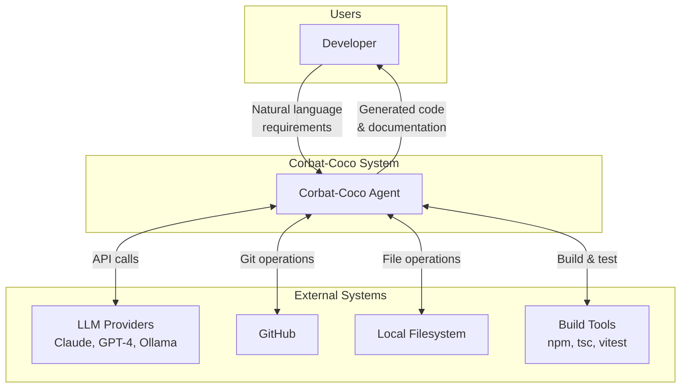
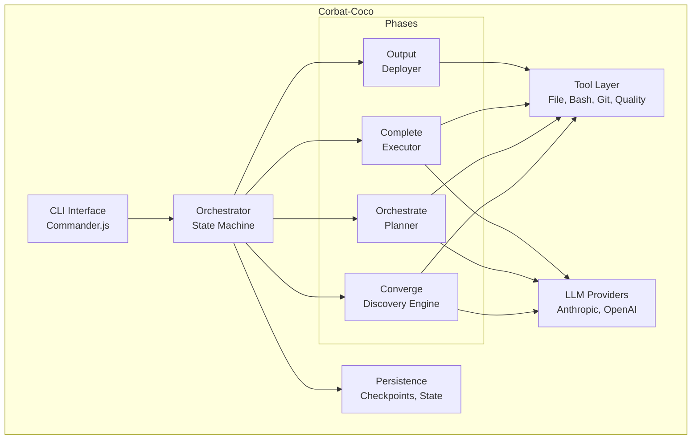
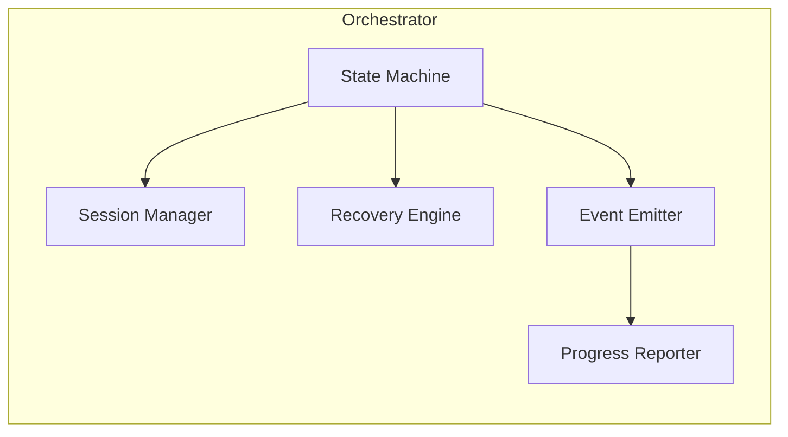
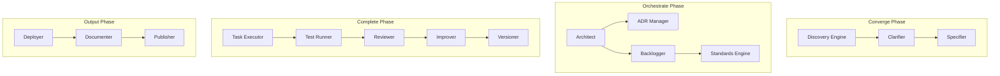
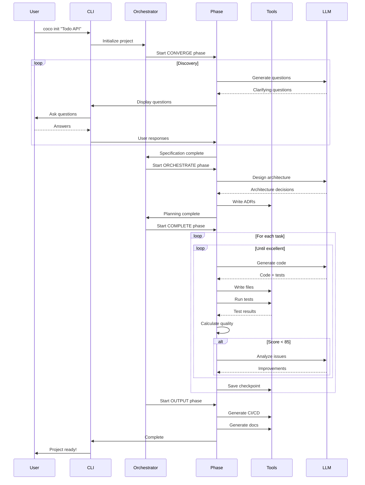

# Corbat-Coco Architecture

> Autonomous Coding Agent with Self-Review and Quality Convergence

---

## Overview

Corbat-Coco follows a **phase-based architecture** inspired by modern software development methodologies. The system is designed to transform natural language requirements into production-ready code through iterative refinement.

## System Context (C4 Level 1)



## Container Diagram (C4 Level 2)



## Component Diagram (C4 Level 3)

### Orchestrator Components



### Phase Components



## Data Flow



## Key Design Decisions

### 1. Phase-Based Architecture

The system operates in four distinct phases:

| Phase | Purpose | Key Output |
|-------|---------|------------|
| **Converge** | Understand requirements | Specification |
| **Orchestrate** | Plan architecture | ADRs, Backlog |
| **Complete** | Build with iteration | Working code |
| **Output** | Prepare for production | CI/CD, Docs |

**Rationale:** Clear separation allows for checkpointing, recovery, and focused optimization of each phase.

### 2. Quality-Driven Iteration

Code is iteratively improved until it meets senior-level quality standards:

```
Score >= 85 AND (Score[n] - Score[n-1] < 2)
```

**Rationale:** Ensures consistently high-quality output without infinite loops.

### 3. Checkpoint-Based Recovery

State is persisted at key moments:
- Phase transitions
- Task start/complete
- Every 5 minutes
- On error

**Rationale:** Enables recovery from any interruption without losing progress.

### 4. Tool Abstraction Layer

All file system, process, and external tool interactions go through a unified tool layer.

**Rationale:** Enables testing, auditing, and potential sandboxing of operations.

## Technology Choices

| Component | Technology | Rationale |
|-----------|------------|-----------|
| Runtime | Node.js 22+ | Modern ESM, good perf |
| Language | TypeScript 5.4+ | Type safety, tooling |
| CLI | Commander.js | Mature, well-documented |
| Prompts | @clack/prompts | Beautiful terminal UI |
| Validation | Zod | Runtime type checking |
| Testing | Vitest | Fast, ESM-native |
| Linting | Oxlint | Fast, low config |
| LLM | Anthropic SDK | Best for coding tasks |

## Security Considerations

1. **API Keys**: Stored in environment variables, never in config files
2. **File Operations**: Restricted to project directory by default
3. **Bash Execution**: Sandboxed with timeout limits
4. **Checkpoints**: Stored locally with restricted permissions

## Scalability

The architecture supports:

- **Large Projects**: Incremental processing, context management
- **Multiple LLM Providers**: Abstraction layer allows switching
- **Custom Tools**: Plugin system for domain-specific tools
- **Parallel Execution**: Independent tasks can run concurrently

## Future Considerations

1. **GUI Application**: Electron-based desktop app
2. **Team Features**: Shared projects, collaborative editing
3. **Cloud Sync**: Remote checkpoint storage
4. **Custom LLMs**: Fine-tuned models for specific domains
